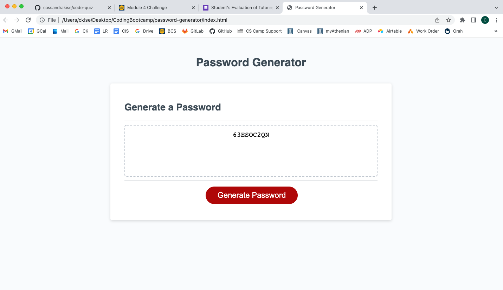

Third submission:

This password generator submission includes math.floor/math.random functions, as well as a handful of if loops to create the combined password as requested. 

https://cassandrakise.github.io/password-generator/
https://github.com/cassandrakise/password-generator

Screenshot:

________________
